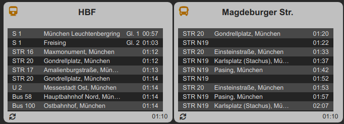

# FHEM

Helper scripts for my FHEM Home Automation installation

Currently supported:

## weekprofile 
Simplify definition and import of FHEM weekprofiles

## departure_device
Web scraper of public transport data from DB Reiseauskunft and push
into a FHEM dummy device. Data can be visualized either in a readingsgroup 
device or via a modified version of the FTUI departure widget (will follow soon).

To improve the handling of the Python scripts I will try to create Dockerfiles
whereever nescessary or requested.

